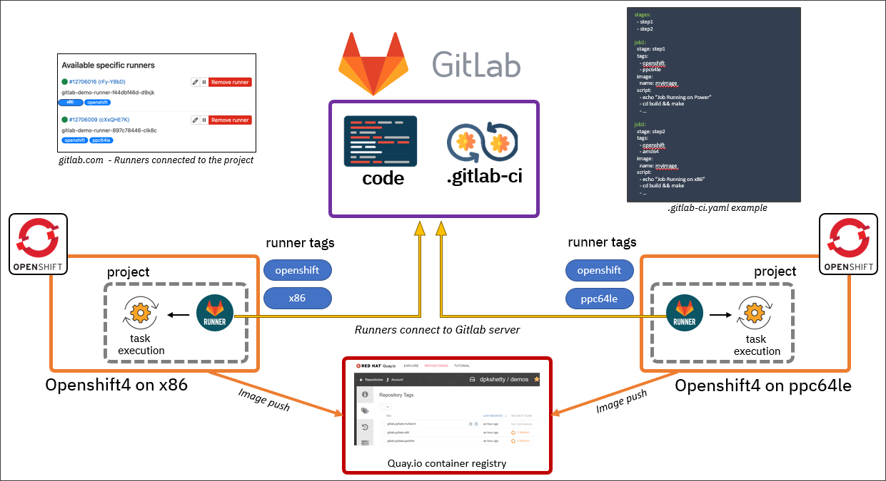

# Setup GitLab Runner on OpenShift
### Inspiration for demo
The CI pipeline gets triggered whenever a change is made to the pipeline itself and/or application code. This pipeline trigger will cause the OpenShift cluster to build the HW architecture-specific container image(s)—x86 image and ppc64le image in our case—and push them to the container registry (Quay.io in this case). Eventually, the pipeline will combine the different (HW-specific) container images and create a multi-architecture (single) image which can be used across x86 and ppc64le OpenShift clusters. This saves the developers and operations team from dealing with multiple container images for an application.

Detailed Instructions [here](https://developer.ibm.com/tutorials/build-multi-architecture-x86-and-power-container-images-using-gitlab/#step-7-a-peek-at-the-gitlab-ci-pipeline-yaml-file-10) 

Using Gitlab-CI pipeline across multiple OpenShift clusters with different CPU architectures.



### Install operator
```sh
cat << EOF | oc apply -f-
apiVersion: operators.coreos.com/v1alpha1
kind: Subscription
metadata:
  labels:
    operators.coreos.com/gitlab-runner-operator.openshift-operators: ""
  name: gitlab-runner-operator
  namespace: openshift-operators
spec:
  channel: stable
  installPlanApproval: Automatic
  name: gitlab-runner-operator
  source: certified-operators
  sourceNamespace: openshift-marketplace
EOF
```
### Create Project
```sh
# oc new-project demo  
cat << EOF | oc apply -f-
apiVersion: v1
kind: Namespace
metadata:
  name: demo
EOF
```

### Create Secret
> echo -n 'token' | base64


``` sh
cat << EOF | oc apply -f-
kind: Secret
apiVersion: v1
metadata:
  name: gitlab-runner-secret
  namespace: demo
data:
  runner-registration-token: R1IxMzQ4OTQxUlJCVEV6U3l6WE5uV3VmeHJQeGk=
type: Opaque
EOF
```

### Create ServiceAccount
``` sh
cat << EOF | oc apply -f-
apiVersion: v1
kind: ServiceAccount
metadata:
  name: gitlab-runner-sa
  namespace: demo
EOF
```

### Create Runner
``` sh
cat << EOF | oc apply -f-
apiVersion: apps.gitlab.com/v1beta2
kind: Runner
metadata:
  name: example-runner
  namespace: demo
spec:
  concurrent: 10
  gitlabUrl: https://gitlab.com
  serviceaccount: gitlab-runner-sa
  tags: openshift, x86
  token: gitlab-runner-secret
EOF
```

### Create Rolebindings
``` sh
cat << EOF | oc apply -f-
kind: RoleBinding
apiVersion: rbac.authorization.k8s.io/v1
metadata:
  name: add-anyuid-to-my-gitlab-sa
  namespace: demo
subjects:
  - kind: ServiceAccount
    name: gitlab-runner-sa
    namespace: demo
roleRef:
  apiGroup: rbac.authorization.k8s.io
  kind: ClusterRole
  name: 'system:openshift:scc:anyuid'
EOF

cat << EOF | oc apply -f-
kind: RoleBinding
apiVersion: rbac.authorization.k8s.io/v1
metadata:
  name: add-my-gitlab-sa-to-runner-app-role
  namespace: demo
subjects:
  - kind: ServiceAccount
    name: gitlab-runner-sa
    namespace: demo
roleRef:
  apiGroup: rbac.authorization.k8s.io
  kind: Role
  name: gitlab-runner-app-role
EOF
```
### Create Robot Account on Quay


### Create variables in GitLab to access Quay using robot account
create 2 variable
1. quay_user
2. quay_passwd

`.gitlab-ci.yml` will reference these when pushing images to quay


### Run pipeline


### Deploy Application
``` sh
oc new-app quay.io/arslankhanali/demo-multiarch:tag-demo-multiarch-multiarch
oc expose service/demo-multiarch
```

### Delete application
```sh
oc delete all --selector app=demo-multiarch
```
# Thank You
The End


### To Test locally on laptop
```sh
python3 app.py   

uname -m

http://127.0.0.1:5000/architecture
```
#### Podman Build
```sh
# --arch=arch
# Set the architecture of the image to be built, and that of the base image to be pulled, if the build uses one, to the provided value instead of using the architecture of the build host. Unless overridden, subsequent lookups of the same image in the local storage matches this architecture, regardless of the host. (Examples: arm, arm64, 386, amd64, ppc64le, s390x)

# x86 (default)
podman build -t demo-multiarch-x86 -f Containerfile .
podman run -d -p 5000:5000 --name demo-multiarch-container-x86 demo-multiarch-x86

# arm64
podman build -t demo-multiarch-arm64 -f Containerfile . --arch=arm64  
podman run -d -p 5001:5000 --name demo-multiarch-container-arm64 demo-multiarch-arm64

# Z
podman build -t demo-multiarch-s390x -f Containerfile . --arch=s390x  
podman run -d -p 5002:5000 --name demo-multiarch-run-s390x demo-multiarch-s390x

# PPC
podman build -t demo-multiarch-ppc64le -f Containerfile . --arch=ppc64le  
podman run -d -p 5003:5000 --name demo-multiarch-run-ppc64le demo-multiarch-ppc64le

```