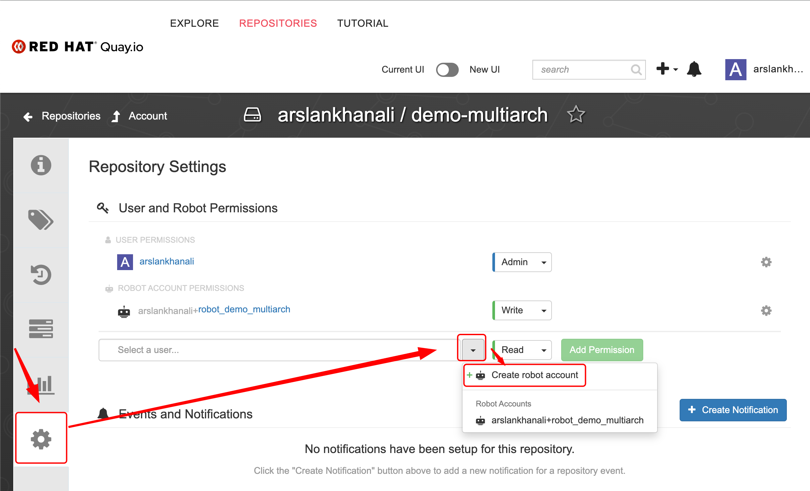

# Setup GitLab Runner on OpenShift
### Inspiration for demo
The CI pipeline gets triggered whenever a change is made to the pipeline itself and/or application code. This pipeline trigger will cause the OpenShift cluster to build the HW architecture-specific container image(s)—x86 image and ppc64le image in our case—and push them to the container registry (Quay.io in this case). Eventually, the pipeline will combine the different (HW-specific) container images and create a multi-architecture (single) image which can be used across x86 and ppc64le OpenShift clusters. This saves the developers and operations team from dealing with multiple container images for an application.

Detailed Instructions [here](https://developer.ibm.com/tutorials/build-multi-architecture-x86-and-power-container-images-using-gitlab/#step-7-a-peek-at-the-gitlab-ci-pipeline-yaml-file-10) 

Using Gitlab-CI pipeline across multiple OpenShift clusters with different CPU architectures.


### Install operator
Most of these steps will be similar on different OpenShift clusters. Except `create Runner` part where you will have to provide the correct tag.  
```sh
cat << EOF | oc apply -f-
apiVersion: operators.coreos.com/v1alpha1
kind: Subscription
metadata:
  labels:
    operators.coreos.com/gitlab-runner-operator.openshift-operators: ""
  name: gitlab-runner-operator
  namespace: openshift-operators
spec:
  channel: stable
  installPlanApproval: Automatic
  name: gitlab-runner-operator
  source: certified-operators
  sourceNamespace: openshift-marketplace
EOF
```
### Create Project
```sh
# oc new-project demo  
cat << EOF | oc apply -f-
apiVersion: v1
kind: Namespace
metadata:
  name: demo
EOF
```

### Create Secret

  
> To convert token to base64 and edit below  
>  `echo -n 'GL127690123602193703217' | base64`
``` sh
cat << EOF | oc apply -f-
kind: Secret
apiVersion: v1
metadata:
  name: gitlab-runner-secret
  namespace: demo
data:
  runner-registration-token: R1IxMzQ4OTQxUlJCVEV6U3l6WE5uV3VmeHJQeGk= # replace with yours
type: Opaque
EOF
```

### Create ServiceAccount
``` sh
cat << EOF | oc apply -f-
apiVersion: v1
kind: ServiceAccount
metadata:
  name: gitlab-runner-sa
  namespace: demo
EOF
```

### Create Runner (Will be different to each cluster)
Use the correct `tag` as per your arch and then reference it in `.gitlab-ci.yml` file.  
Examples:  
`tags: openshift, x86` (as used in our case below)  
or  
`tags: openshift, s390x`  
or  
`tags: openshift, ppc64le`  
or  
`tags: openshift, arm`  

``` sh
cat << EOF | oc apply -f-
apiVersion: apps.gitlab.com/v1beta2
kind: Runner
metadata:
  name: example-runner
  namespace: demo
spec:
  concurrent: 10
  gitlabUrl: https://gitlab.com
  serviceaccount: gitlab-runner-sa
  tags: openshift, x86
  token: gitlab-runner-secret
EOF
```

### Create Rolebindings
``` sh
cat << EOF | oc apply -f-
kind: RoleBinding
apiVersion: rbac.authorization.k8s.io/v1
metadata:
  name: add-anyuid-to-my-gitlab-sa
  namespace: demo
subjects:
  - kind: ServiceAccount
    name: gitlab-runner-sa
    namespace: demo
roleRef:
  apiGroup: rbac.authorization.k8s.io
  kind: ClusterRole
  name: 'system:openshift:scc:anyuid'
EOF

cat << EOF | oc apply -f-
kind: RoleBinding
apiVersion: rbac.authorization.k8s.io/v1
metadata:
  name: add-my-gitlab-sa-to-runner-app-role
  namespace: demo
subjects:
  - kind: ServiceAccount
    name: gitlab-runner-sa
    namespace: demo
roleRef:
  apiGroup: rbac.authorization.k8s.io
  kind: Role
  name: gitlab-runner-app-role
EOF
```
### Create Robot Account on Quay


### Create variables in GitLab to access Quay using robot account
Create 2 variables  
1. quay_user
2. quay_passwd

`.gitlab-ci.yml` will reference these when pushing images to quay.


> APIs can be used to create these variables as well.
### Run pipeline


### Verify


### Deploy Application
``` sh
# Deploy using CLI
oc project demo
oc new-app quay.io/arslankhanali/demo-multiarch:tag-demo-multiarch-multiarch
oc create route edge demo-multiarch --service=demo-multiarch --port=5000

# Deploy using GitOps 
oc apply -f manifests  
```

### Delete application
```sh
oc delete all --selector app=demo-multiarch
```
# Thank You
The End