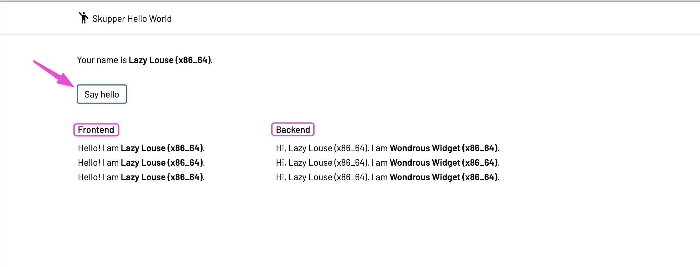

# Multi arch demo
### Introduction
The CI pipeline gets triggered whenever a change is made to the pipeline itself and/or application code. This pipeline trigger will cause the OpenShift cluster to build the HW architecture-specific container image(s)—x86 image and ppc64le image in our case—and push them to the container registry (Quay.io in this case). Eventually, the pipeline will combine the different (HW-specific) container images and create a multi-architecture (single) image which can be used across x86 and ppc64le OpenShift clusters. This saves the developers and operations team from dealing with multiple container images for an application.

Using Gitlab-CI pipeline across multiple OpenShift clusters with different CPU architectures.


### Some Notes about this repo:
Before we start, here are some fyi only
  - **Continuous Integration**: This Readme will focus on GITLAB-RUNNERS for CI. But there is also working code for TEKTON-PIPELINES and [GITHUB-ACTIONS](https://github.com/arslankhanali/demo_multiarch) in this repository. GITHUB-ACTIONS workflow builds image for 6 (arm, arm64, 386, amd64, ppc64le, s390x) different CPU architectures each time the code is pushed to github. All the resultant images are in 2 repositories quay.io/arslankhanali/skupper-frontend & quay.io/arslankhanali/skupper-backend.
  - **argo**: folder has the code to deploy application with GitOps
  - **Manifests**: You can also use manifests to deploy application

### Pre-Reqs 
1. Access to OCP cluster on x86 and PPC
2. Quay.io account with 2 repositories
   1. [quay.io/arslankhanali/skupper-frontent](https://quay.io/repository/arslankhanali/skupper-frontend?tab=tags)
   2. [quay.io/arslankhanali/skupper-backend](https://quay.io/repository/arslankhanali/skupper-backend?tab=tags)
3. [gitlab repo](https://gitlab.com/arslankhanali/demo_multiarch)

### Our Application
- We will be using modified hello-world application from skupper.io.
  - It consistes of a frontend and backend, both available on port 8080
  - Each time you click on 'Say hello' it will ping a backend service and get its name and cpu architecture.
  - You can deploy multiple backends on different Openshift clusters and have them connect to the frontend service via scupper.


## Index
1. CI Pipeline
   1. Setup GitLab Runner on clusters
   2. Provide Gitlab with Quay variables.
2. Deploy Application
   1. Deploy frotend on cluster1
   2. Deploy backend on cluster2
3. Connect both namespaces with skupper
   1. Verify that app is running
4. CONGRATULATIONS - You have done it

### Login to our Openshift clusters in terminal. Set a tab for each cluster
```sh
# canberra: TERMINAL TAB
export KUBECONFIG=$HOME/.kube/config-canberra
oc login  --server=https://api.cluster-pmvqm.sandbox432.opentlc.com:6443
oc get -o jsonpath='{.status.infrastructureName}' infrastructure cluster

# sydney: TERMINAL TAB
export KUBECONFIG=$HOME/.kube/config-sydney
oc login --server=https://api.cluster-s5cqt.dynamic.redhatworkshops.io:6443
oc get -o jsonpath='{.status.infrastructureName}' infrastructure cluster
```
Use `export KUBECONFIG=$HOME/.kube/config-sydney` in any new terminal tab to make sure it connects to this particular cluster.


### Setup GitLab Runner on clusters
### Install GitLab operator - [Same on Both cluster]
Most of these steps will be similar on any OpenShift clusters. Except `create Runner` part where you will have to provide the correct tag.  
```sh
cat << EOF | oc apply -f-
apiVersion: operators.coreos.com/v1alpha1
kind: Subscription
metadata:
  labels:
    operators.coreos.com/gitlab-runner-operator.openshift-operators: ""
  name: gitlab-runner-operator
  namespace: openshift-operators
spec:
  channel: stable
  installPlanApproval: Automatic
  name: gitlab-runner-operator
  source: certified-operators
  sourceNamespace: openshift-marketplace
EOF
```
### Create a gitlab Project [Same on Both cluster]
Gitlab Runner pods will run in this project.  
These pods will help in building images.
```sh
# oc new-project gitlab  
cat << EOF | oc apply -f-
apiVersion: v1
kind: Namespace
metadata:
  name: gitlab
EOF
```

### Create Secret [Same on Both cluster]
Get gitlab runner secret.  

  
> To convert token to base64 and edit below  
```sh
echo -n <GL127690123602193703217> | base64
```

``` sh
cat << EOF | oc apply -f-
kind: Secret
apiVersion: v1
metadata:
  name: gitlab-runner-secret
  namespace: gitlab
data:
  runner-registration-token: R1IxMzQ4OTQxY1hwNHUI0ek5QbW0=
type: Opaque
EOF
```

### Create ServiceAccount [Same on Both cluster]
``` sh
cat << EOF | oc apply -f-
apiVersion: v1
kind: ServiceAccount
metadata:
  name: gitlab-runner-sa
  namespace: gitlab
EOF
```

### Create Runner [DIFFERENT on Both cluster]
Use the correct `tag` as per your arch and then reference it in `.gitlab-ci.yml` file.  
Examples:  
`tags: openshift, x86` (as used in our case below)  
or  
`tags: openshift, s390x`  
or  
`tags: openshift, ppc64le`  
or  
`tags: openshift, arm`  

``` sh
# For x86 OCP Cluster
cat << EOF | oc apply -f-
apiVersion: apps.gitlab.com/v1beta2
kind: Runner
metadata:
  name: example-runner
  namespace: gitlab
spec:
  concurrent: 10
  gitlabUrl: https://gitlab.com
  serviceaccount: gitlab-runner-sa
  tags: openshift, x86
  token: gitlab-runner-secret
EOF

# For PPC OCP Cluster
cat << EOF | oc apply -f-
apiVersion: apps.gitlab.com/v1beta2
kind: Runner
metadata:
  name: example-runner
  namespace: gitlab
spec:
  concurrent: 10
  gitlabUrl: https://gitlab.com
  serviceaccount: gitlab-runner-sa
  tags: openshift, ppc64le
  token: gitlab-runner-secret
EOF
```

### Create Rolebindings [Same on Both cluster]
``` sh
cat << EOF | oc apply -f-
kind: RoleBinding
apiVersion: rbac.authorization.k8s.io/v1
metadata:
  name: add-anyuid-to-my-gitlab-sa
  namespace: gitlab
subjects:
  - kind: ServiceAccount
    name: gitlab-runner-sa
    namespace: gitlab
roleRef:
  apiGroup: rbac.authorization.k8s.io
  kind: ClusterRole
  name: 'system:openshift:scc:anyuid'
EOF

cat << EOF | oc apply -f-
kind: RoleBinding
apiVersion: rbac.authorization.k8s.io/v1
metadata:
  name: add-my-gitlab-sa-to-runner-app-role
  namespace: gitlab
subjects:
  - kind: ServiceAccount
    name: gitlab-runner-sa
    namespace: gitlab
roleRef:
  apiGroup: rbac.authorization.k8s.io
  kind: Role
  name: gitlab-runner-app-role
EOF
```
### Verify that Runner are running on both OCP clusters


## Provide Gitlab with Quay variables.
### Create Robot Account on Quay
This is needed so gitlab pipeline can push images to Quay.  
Create 2 PUBLIC repositories.
- skupper-frontend 
- skupper-backend
- Give robotaccount access to the BOTH repositories. Access to skupper-frontend is shown below. Do the same for skupper-backend


### Create variables in GitLab to access Quay using robot account
Create 2 variables  
1. quay_user
2. quay_passwd

`.gitlab-ci.yml` will reference these when pushing images to quay.


> APIs can be used to create these variables as well.
### Run pipeline
Push changes to git repo and CI pipeline will start Automatically.  
New pods with the name of 'runner*' will pop up in gitlab project in both OCP clusters.  
Check the status of CI pipeline.

You can see the logs by clicking on each Job  

### Verify


# Deploy Application
## Scenario 1: On 2 different OCP clusters
### Deploy on cluster1
``` sh
# NAMESPACE CANBERRA
# Deploy frontend in namespace canberra
oc new-project canberra
oc new-app --name=frontend -l app=hello quay.io/arslankhanali/skupper-frontend:latest
oc create route edge frontend --service=frontend --port=8080
echo "https://$(oc get route frontend -o jsonpath='{.spec.host}')" 

skupper init --enable-console --enable-flow-collector
skupper token create ~/canberra-sydney.token
skupper token create ~/canberra-melbourne.token

echo "https://$(oc get route skupper -o jsonpath='{.spec.host}')"
oc get secret skupper-console-users -n canberra -o jsonpath='{.data.admin}' | base64 --decode # user is admin

# Stress test. https://<url-from-above>/api/hello
ab -n 100 -c 10 -p skupper-app/payload.json -T application/json "https://$(oc get route frontend -o jsonpath='{.spec.host}')"/api/hello

# NAMESPACE SYDNEY
# Open new terminal tab - make sure its still cluster1
# Deploy backend in namespace sydney
oc new-project sydney
oc new-app --name=backend -l app=hello quay.io/arslankhanali/skupper-backend:latest

skupper init --ingress none
skupper link create ~/canberra-sydney.token
skupper expose deployment/backend --port 8080
 
```

### Deploy on cluster2
``` sh
# NAMESPACE MELBOURNE
# Deploy backend in namespace melbourne
oc new-project melbourne
oc new-app --name=backend -l app=hello quay.io/arslankhanali/skupper-backend:latest
 
skupper init --ingress none
skupper link create ~/canberra-melbourne.token
skupper expose deployment/backend --port 8080

```
## Scenario 2: On same OCP cluster
```sh
# NAMESPACE east
# Deploy frontend in namespace east
oc new-project east
oc new-app --name=frontend -l app=hello quay.io/arslankhanali/skupper-frontend:latest
oc create route edge frontend --service=frontend --port=8080
echo "https://$(oc get route frontend -o jsonpath='{.spec.host}')" 

skupper init --enable-console --enable-flow-collector
skupper token create ~/east-west.token

oc get secret skupper-console-users -n east -o jsonpath='{.data.admin}' | base64 --decode # user is admin

# Stress test. https://<url-from-above>/api/hello
ab -n 100 -c 10 -p skupper-app/payload.json -T application/json "https://$(oc get route frontend -o jsonpath='{.spec.host}')"/api/hello

# NAMESPACE west
# Open new terminal tab - make sure its still cluster1
# Deploy backend in namespace west
oc new-project west
oc new-app --name=backend -l app=hello quay.io/arslankhanali/skupper-backend:latest

skupper init --ingress none
skupper link create ~/east-west.token
skupper expose deployment/backend --port 8080
 
```
### Delete application
```sh
# skupper 
skupper delete
# App
oc delete all --selector app=hello
```
# Thank You
The End