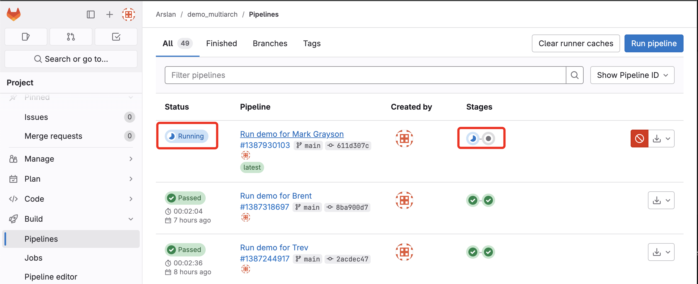
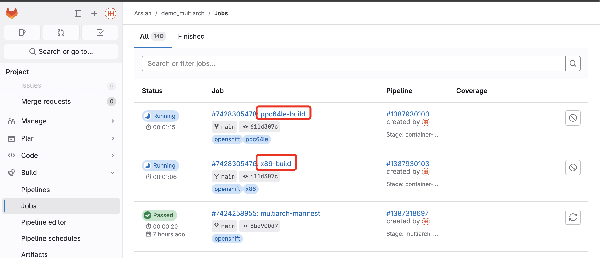
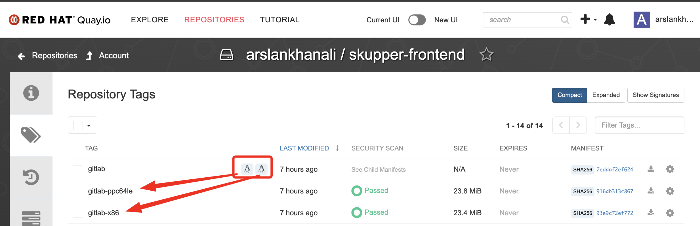
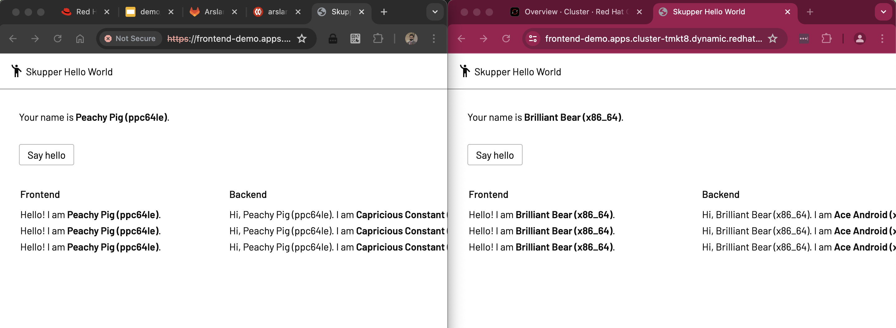
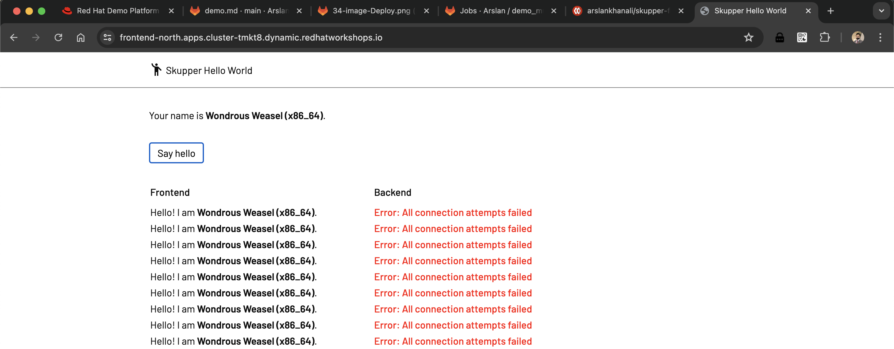
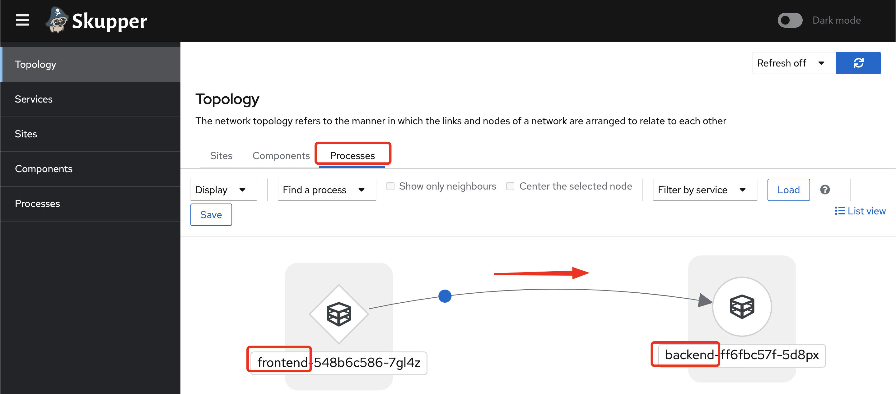
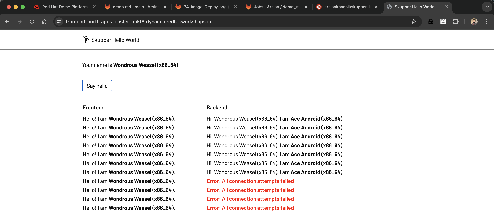

# Demo Run
## Setup
### 1 Setup Tabs - PPC and x86
```sh
# PPC: TERMINAL TAB
export KUBECONFIG=$HOME/.kube/config-ppc
oc login  --server=https://api.cluster-pmvqm.sandbox432.opentlc.com:6443
oc get -o jsonpath='{.status.infrastructureName}' infrastructure cluster

# x86: TERMINAL TAB
export KUBECONFIG=$HOME/.kube/config-x86
oc login --server=https://api.cluster-s5cqt.dynamic.redhatworkshops.io:6443
oc get -o jsonpath='{.status.infrastructureName}' infrastructure cluster
```

### 2 Setup Tabs  - 'x86 east' and 'x86 west'
```sh
# PPC: TERMINAL TAB
export KUBECONFIG=$HOME/.kube/config-ppc
oc login  --server=https://api.cluster-pmvqm.sandbox432.opentlc.com:6443
oc get -o jsonpath='{.status.infrastructureName}' infrastructure cluster

# x86: TERMINAL TAB
export KUBECONFIG=$HOME/.kube/config-x86
oc login --server=https://api.cluster-s5cqt.dynamic.redhatworkshops.io:6443
oc get -o jsonpath='{.status.infrastructureName}' infrastructure cluster
```
## Act 1 - Build
``` sh
cd /Users/arslankhan/Codes/demo_multiarch
ls # Show App Code
date >> date.txt       
git commit -am "Run demo for Mark Grayson"
git push origin main 
# Show Pipeline
# Show Jobs
# Show Quay - image repository
```




## Act 2 - Deploy
``` sh
# Check CPU Arch of all nodes in cluster
oc get nodes -o wide
# On PPC and x86 - Run the same commands on both
oc new-project demo
oc project demo
# Deploy Backend
oc new-app --name=backend -l app=hello quay.io/arslankhanali/skupper-backend:latest
# Deploy Frontend
oc new-app --name=frontend -l app=hello quay.io/arslankhanali/skupper-frontend:latest
oc create route edge frontend --service=frontend --port=8080
echo "https://$(oc get route frontend -o jsonpath='{.spec.host}')" 

# Clean for new demo
oc delete all --selector app=hello
```


## Act 3 - Connect
```sh
# ----------------
# NAMESPACE east
# ----------------
# Deploy frontend in namespace east
oc new-project east
oc new-app --name=frontend -l app=hello quay.io/arslankhanali/skupper-frontend:latest
oc create route edge frontend --service=frontend --port=8080
echo "https://$(oc get route frontend -o jsonpath='{.spec.host}')" 

skupper init --enable-console --enable-flow-collector
skupper token create ~/east-west.token

# ----------------
# NAMESPACE west
# ----------------
# Open new terminal tab - make sure its still cluster1
# Deploy backend in namespace west
oc new-project west
oc new-app --name=backend -l app=hello quay.io/arslankhanali/skupper-backend:latest

oc scale deployment backend --replicas=3

skupper init --ingress none
skupper link create ~/east-west.token
skupper expose deployment/backend --port 8080
```
Before


After

### 6. Delete
```sh
# skupper 
skupper delete
skupper delete link link1

# App
oc get pods -l app=hello
oc delete all --selector app=hello
```