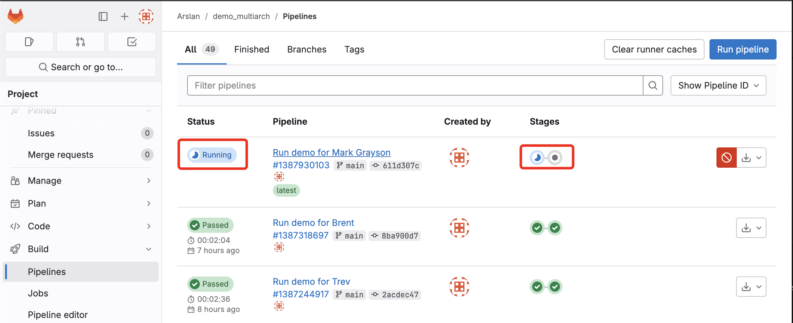
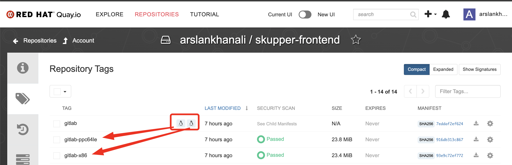

# Demo Run
## Setup

## Git hub secrests check
https://github.com/arslankhanali/demo_multiarch/settings/secrets/actions/QUAY_PASSWORD
https://github.com/arslankhanali/demo_multiarch/settings/secrets/actions/QUAY_PASSWORD
### Setup Tabs  - '86' and 'arm'
```sh
oc login --token=sha256~yLWMeIWs7xJV73Py5rs8vGmlXaUo5Hp_13o1NJadwls --server=https://api.cluster-2bkw8.2bkw8.sandbox1789.opentlc.com:6443

oc login --token=sha256~769Sw4QDb2afvntkncAW0jIURAiKHTX6m3uweUfCAhc --server=https://api.cluster-z94pq.z94pq.sandbox1166.opentlc.com:6443

# get contxt
oc config get-contexts

# Rename the long context string to "dev"
oc config rename-context default/api-cluster-2bkw8-2bkw8-sandbox1789-opentlc-com:6443/admin x86
oc config rename-context default/api-cluster-z94pq-z94pq-sandbox1166-opentlc-com:6443/kube:admin arm

# Show clusters
oc config get-contexts

alias oc-x86='oc config use-context x86'
alias oc-arm='oc config use-context arm'

# Show architecture under KERNEL-VERSION column
oc get nodes -o wide --context=x86
oc get nodes -o wide --context=arm
```
## Act 1 - Build
``` sh
cd ~/Codes/demo.redhat.com/demo_multiarch
ls # Show App Code
date >> date.txt       
git commit -am "Run demo arch-cop"
git push origin main 

# Show Pipeline
https://github.com/arslankhanali/demo_multiarch/blob/main/.github/workflows/docker-image.yml
# Show Git hub Actions
https://github.com/arslankhanali/demo_multiarch/actions/runs/
# Show Quay - image repository
https://quay.io/repository/arslankhanali/skupper-frontend?tab=tags
```




## Act 2 - Deploy
``` sh
# Check CPU Arch of all nodes in cluster
oc get nodes -o wide
# On PPC and x86 - Run the same commands on both
oc new-project demo
oc project demo
# Deploy Backend
oc new-app --name=backend -l app=hello quay.io/arslankhanali/skupper-backend:latest
# Deploy Frontend
oc new-app --name=frontend -l app=hello quay.io/arslankhanali/skupper-frontend:latest
oc create route edge frontend --service=frontend --port=8080
echo "https://$(oc get route frontend -o jsonpath='{.spec.host}')" 

# Clean for new demo
oc delete all --selector app=hello
```


## Act 3 - Connect
```sh
# ----------------
# NAMESPACE east
# ----------------
# Deploy frontend in namespace east
oc new-project east
oc new-app --name=frontend -l app=hello quay.io/arslankhanali/skupper-frontend:latest
oc create route edge frontend --service=frontend --port=8080
echo "https://$(oc get route frontend -o jsonpath='{.spec.host}')" 

skupper init --enable-console --enable-flow-collector
skupper token create ~/east-west.token

# ----------------
# NAMESPACE west
# ----------------
# Open new terminal tab - make sure its still cluster1
# Deploy backend in namespace west
oc new-project west
oc new-app --name=backend -l app=hello quay.io/arslankhanali/skupper-backend:latest

oc scale deployment backend --replicas=3

skupper init --ingress none
skupper link create ~/east-west.token
skupper expose deployment/backend --port 8080
```
Before


After

### 6. Delete
```sh
# skupper 
skupper delete
skupper delete link link1

# App
oc get pods -l app=hello
oc delete all --selector app=hello
```