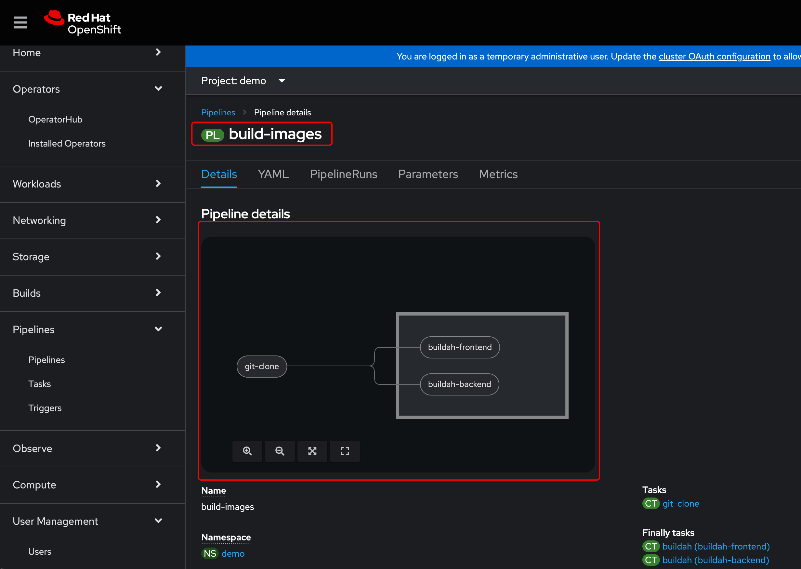

# To Build on Tekton
### Create a pvc
```sh
cat << EOF | oc apply -f-
apiVersion: v1
kind: PersistentVolumeClaim
metadata:
  name: demo-pvc
  namespace: demo
  labels:
    app: demo-multiarch
spec:
  accessModes:
    - ReadWriteOnce
  volumeMode: Filesystem
  resources:
    requests:
      storage: 2Gi
EOF
```

### Create a quay password
```sh
cat << EOF | oc apply -f-
apiVersion: v1
kind: Secret
metadata:
  labels:
    app: demo-multiarch
name: quay-authentication
annotations:
   tekton.dev/docker-0: https://quay.io # Described below
type: kubernetes.io/basic-auth
stringData:
username: arslankhanali
password: <pass>
EOF
```
### Give service account 'pipeline' access to the secret
```sh
oc patch serviceaccount pipeline -p '{"secrets": [{"name": "quay-authentication"}]}'
```
### Create Pipeline
```sh
oc apply -f tekton/pipeline.yaml
```


### Run Pipeline
```sh
oc apply -f tekton/pipelinerun.yaml
```


### Verify


### Deploy Application
``` sh
# Deploy using CLI
oc project demo
oc new-app quay.io/arslankhanali/demo-multiarch:tektonbuild
oc create route edge demo-multiarch --service=demo-multiarch --port=5000 
```

### Delete application
```sh
oc delete all --selector app=demo-multiarch
```
# Thank You
The End